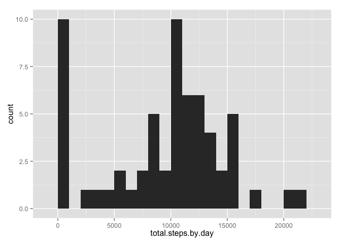
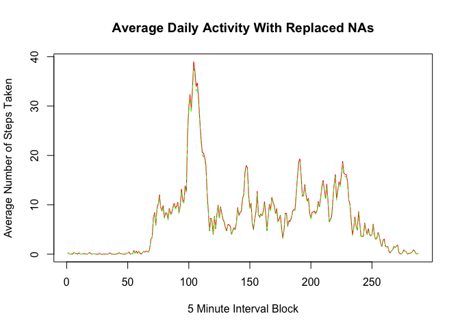
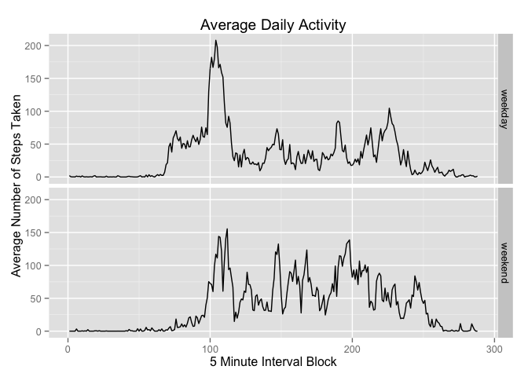

# Reproducible Research: Peer Assessment 1


## Loading and preprocessing the data

1. Load the data.table library
2. Read activity.csv as the data.table activity
3. Turns the date and interval into factors


```r
library(data.table)
activity <- data.table(read.csv("activity.csv"))
activity$date <- as.Date(activity$date)
activity$interval <- factor(activity$interval)
```

## What is mean total number of steps taken per day?

Create a histogram of the total steps in a day

```r
library(ggplot2)
total.steps.by.day <- tapply(activity$steps, activity$date, FUN=sum, na.rm=TRUE)

qplot(total.steps.by.day, binwidth=1000)
```

 


Calculates mean and median for total steps in a day

```r
mean(total.steps.by.day, na.rm=TRUE)
```

```
## [1] 9354.23
```

```r
median(total.steps.by.day, na.rm=TRUE)
```

```
## [1] 10395
```

## What is the average daily activity pattern?

Calculates the average steps per 5 minute time bin, discluding NA

```r
total.steps.by.time <- tapply(activity$steps, activity$interval, FUN=sum, na.rm=TRUE)
average.steps.by.time <- total.steps.by.time / length(levels(activity$interval))
plot(average.steps.by.time, type = "l", xlab="5 Minute Interval Block", ylab="Average Number of Steps Taken", main="Average Daily Activity")
```

 


## Imputing missing values

Calculate the notal number of missing values

```r
(complete.cases(activity))["FALSE"]
```

```
## [1] NA
```

Create new dataset, with NAs filled in based on 5-min average

```r
completeActivity <- activity

completeActivity$steps[which(is.na(activity$steps))] <- average.steps.by.time[activity$interval[which(is.na(activity$steps))]]
```

Plot the new dataset in red, and the old dataset in green, with filled in results

```r
new.total.steps.by.time <- tapply(completeActivity$steps, completeActivity$interval, FUN=sum, na.rm=TRUE)
new.average.steps.by.time <- new.total.steps.by.time / length(levels(completeActivity$interval))
plot(new.average.steps.by.time, type = "l", col="red", xlab="5 Minute Interval Block", ylab="Average Number of Steps Taken", main="Average Daily Activity With Replaced NAs")
lines(average.steps.by.time, col="green", lty=2) 
```

 


## Are there differences in activity patterns between weekdays and weekends?

Create a new factor variable in the dataset with two levels, weekend and weekday

```r
test <- weekdays(activity$date)
completeActivity$weekdays <- "weekday"
completeActivity$weekdays[which(weekdays(activity$date) %in% c('Saturday','Sunday'))] <- "weekend"
completeActivity$weekdays <- factor(completeActivity$weekdays)
```

Plot times series for weekends and weekdays for number of steps


```r
averages <- aggregate(steps ~ interval + weekdays, data=completeActivity, mean)


qplot(as.numeric(interval),steps, data=averages, facets = weekdays~., geom="line",main="Average Daily Activity",xlab="5 Minute Interval Block", ylab="Average Number of Steps Taken")
```

 
